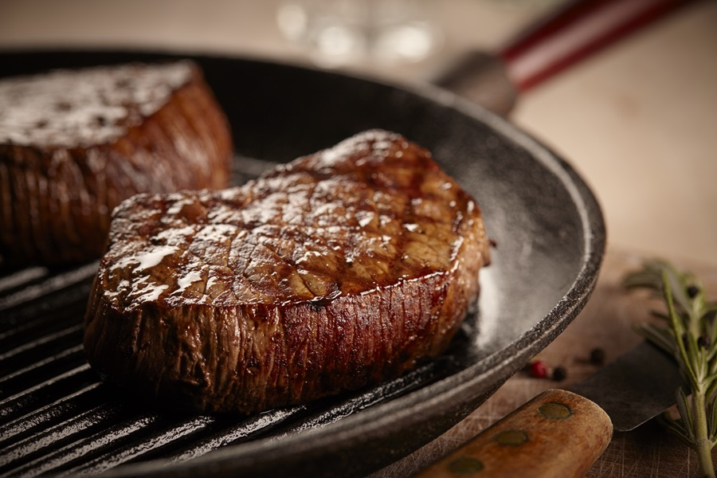

# Hoe maak je kogelbiefstuk klaar?

## Benodigheden

* 500 g kogelbiefstuk
* 4 eetlepels Croma Bakken & Braden vloeibaar

### Bereiding

1. Haal de kogelbiefstuk een half uur voor het bereiden uit de koelkast, zodat het vlees op temperatuur kan komen. 
   Dep de kogelbiefstuk vlak voor het bereiden met keukenpapier droog. 
   Verhit op hoog vuur een scheut Croma Bakken en Braden Vloeibaarin een koekenpan en wacht tot de Croma bruin kleurt.

2. Leg de kogelbiefstuk in de pan. 
   Bak op een hoog vuur 1 minuut per kant lichtbruin. 
   Draai het vuur iets lager. Keer het vlees geregeld, houd het in beweging en bak 5 minuten voor een medium biefstuk.

3. Haal de kogelbiefstuk uit de pan, dek deze af met aluminiumfolie en laat 2 minuten rusten. 
   Voeg zout en peper naar smaak toe. Eet smakelijk!

Search for it.[Visit Recept](https://www.croma.nl/recipes/kogelbiefstuk-190483?gclid=Cj0KCQjw18WKBhCUARIsAFiW7JyfVxsZV4n3QabptebVUA_k8-tTAdclh6E2Fl4xE_IEMikoDFxtmZAaAv0_EALw_wcB)